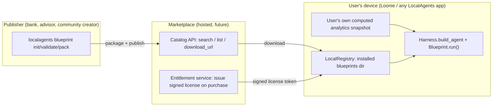

# Blueprint Marketplace Architecture

**Status:** design doc + v0.1 local implementation (`localagents/blueprints/`). Not yet a hosted
service — this describes both what exists today and the roadmap to a real marketplace.

## 1. The idea in one paragraph

LocalAgents already runs agents against a user's own local data with the model never seeing raw
records (see `localagents.agents.wealth_advisor`). A **Blueprint** packages that pattern into a
distributable, versioned unit: a manifest (who published it, what tier/price, what data it
reads) plus agent code (system prompts, scenario logic, orchestration). A **Marketplace** is
just a catalog + licensing layer on top — it never touches user data and never runs anything
itself. The actual stress test always executes on the user's own machine, against their own
already-computed analytics. This is the pitch to a bank: *"publish your advisory logic and
assumptions, reach every user who installs your blueprint, and never receive a single byte of
their financial data."*

## 2. Why this matters for adoption (bank/user/platform incentives)

| Party | What they get |
|---|---|
| **End user** | Runs a bank's real advisory framework against their own numbers, for free or a small fee, entirely offline. No new account with the bank, no data shared with the bank. |
| **Bank / publisher** | A distribution channel for advisory content/brand without building an app, without a data-processing agreement, without PII liability (they never receive user data — huge for a regulated institution). Free blueprints are a customer-acquisition/brand-trust play; paid blueprints are a new revenue line. |
| **Platform (LocalAgents/Loonie)** | Take-rate on paid blueprints; free blueprints drive installs; either way, the differentiator vs. any cloud-agent competitor is "your data never leaves your device," which a bank's compliance team will actively prefer. |

## 3. Core concepts

- **Blueprint** (`localagents.blueprints.BlueprintManifest` + entry module): a `blueprint.yaml`
  manifest (id, name, version, publisher, tier, price, category, declared `inputs`) plus a
  Python entry point `run(harness, snapshot=None, **kwargs) -> str`. Implemented in
  `localagents/blueprints/manifest.py` / `loader.py`.
- **Tiers**: `free` (in-house or community, always runnable) and `paid` (requires a valid
  license token). A future `certified` flag can layer on top of either tier once publisher
  signing verification ships (section 6).
- **LocalRegistry** (`localagents/blueprints/registry.py`): what actually runs at execution
  time — a local `blueprints/` directory. A hosted marketplace's only job is to get a
  blueprint's files into that directory; the runtime protocol never needs to know a network
  request happened.
- **Entitlement** (`localagents/blueprints/license.py`): offline HMAC-signed license tokens.
  Verifying a token proves the marketplace issued it; it is deliberately **not** DRM (a token
  string can be copied) — consistent with this project's local-first, no-lock-in stance. Real
  payment collection happens in the hosted marketplace (Stripe or similar), which then mints the
  token — LocalAgents itself never touches payment data.
- **CLI** (`localagents/cli.py`): `localagents blueprint init|validate|list|run` — the same
  tool a bank's internal team and a solo community creator both use.

## 4. Trust & security model (read this before shipping publicly)

Loading a blueprint currently means importing and executing its Python file **in-process, with
no sandboxing** (`loader.py` docstring says this explicitly). This is fine for local development
and for blueprints you wrote yourself, but is a real code-execution trust boundary before
opening the marketplace to third-party uploads. Roadmap, in priority order:

1. **Publisher signing.** Every packaged blueprint gets a detached signature over its packed
   archive, verified against the publisher's public key before `load_blueprint()` imports
   anything. A "Verified Publisher" badge (bank, licensed advisor) is a real cryptographic
   claim, not just a marketplace UI label.
2. **Static review / allowlist for the catalog.** Before a blueprint is listed (not before a
   user can locally `blueprint run` their own file), a lightweight review checks for network
   calls other than the declared model provider, filesystem access outside the working
   directory, and subprocess/exec calls.
3. **Restricted execution.** Longer-term: run third-party blueprint code in a subprocess with a
   reduced capability set (no filesystem/network beyond what the harness explicitly grants),
   not the host process. Until this ships, the catalog UI must show "runs with full local
   permissions" for any non-certified blueprint, and installing one is an explicit, informed
   user action — never silent/automatic.
4. **Never widen the data boundary.** Blueprints only ever receive the `snapshot` dict the
   calling app passes in (already-computed statistics, e.g. Loonie's
   `GET /wealth/analytics/summary`) — never raw transaction rows, never direct DB access. This
   is enforced by convention today (every specialist prompt in `wealth_advisor.py` and the two
   example blueprints only receives specific dict keys); a future hardening step is to have the
   loader itself pass a read-only, key-filtered view driven by the manifest's declared `inputs`.

## 5. Marketplace service (future hosted component — not built yet)

A minimal hosted service needs exactly three concerns, each independently swappable:

- **Catalog API** — `GET /catalog` returns a JSON array matching
  `localagents.blueprints.registry.MarketplaceIndexEntry` (id, name, version, publisher, tier,
  price, category, summary, `download_url`). `load_catalog()` already reads this exact shape
  from a local file — pointing it at a URL instead is the only future change needed client-side.
- **Storage/CDN** — packed blueprint archives (a zip of the package directory) at each entry's
  `download_url`. No special protocol; any static file host works.
- **Entitlement/payment service** — on purchase, verifies payment (Stripe Checkout, e.g.),
  then calls `localagents.blueprints.license.sign(blueprint_id, version, licensee, secret)` and
  returns the token to the client. The signing `secret` lives only on this server — the app
  never carries it.

None of this needs to exist for local development or for Loonie's own in-house free blueprints
today; it only becomes necessary once third-party publishers (e.g. a real bank) want to list.

## 6. Loonie (consumer app) integration plan

Loonie is the flagship consumer of LocalAgents and the natural home for the marketplace's
end-user UI. This section is a concrete plan, not yet implemented in `apps/web`/`backend`.

### 6.1 Backend additions (`backend/app/`)

- New table `marketplace_installed_blueprints` (user_id, blueprint_id, version, tier,
  license_token nullable, installed_at) — mirrors the existing `WealthWatchlistItem`-style
  simple CRUD table pattern already in this codebase.
- New router `routers/marketplace.py`:
  - `GET /marketplace/catalog` — proxies/caches the hosted catalog (or reads a bundled local
    JSON file until a hosted service exists).
  - `POST /marketplace/install` — downloads a blueprint archive into a per-user
    `backend/data/blueprints/<user>/<blueprint_id>/` directory (mirrors the existing
    `backend/data/statements/<user>/` pattern), records the install row.
  - `POST /marketplace/blueprints/{id}/run` — loads the installed blueprint via
    `localagents.blueprints.load_blueprint`, builds a `Harness` from the same config the
    existing `ai_provider.py` already uses, passes `snapshot=` from
    `analytics.get_analytics_summary(...)` (already computed, already used by every existing
    agent), and returns the result the same shape as today's `/agents/{id}/run`.
  - This is the first place `backend/` would take a real dependency on the `localagents` pip
    package (confirmed in memory: not yet a dependency) — add it to `requirements.txt` as an
    ordinary pip package, same as any other dependency, never vendored.
- New Alembic migration for the installed-blueprints table, following the existing
  `alembic/versions/` chain.

### 6.2 Frontend additions (`apps/web/src/`)

Two new pages, both top-level routes like `core/decisions/DecisionsPage.tsx` (not nested under
a wealth blueprint, since blueprints are cross-cutting):

- **`core/marketplace/MarketplacePage.tsx`** — end-user browsing/running experience.
  - Card grid of catalog entries: name, publisher, tier badge (Free / Paid $X.XX), category,
    summary, "Verified Publisher" badge once signing ships.
  - Filter by category (`stress_test`, `general`, ...) and tier.
  - "Install" button (free) or "Buy & Install" (paid, opens a checkout flow — out of scope for
    v1, can start as an external payment link that returns a license token to paste in).
  - Installed blueprints get a "Run against my profile" button — calls
    `POST /marketplace/blueprints/{id}/run`, shows the returned narrative in a modal/panel
    styled like the existing `InsightsPage.tsx` agent-card output.
- **`core/marketplace/BlueprintStudioPage.tsx`** — creator/publisher authoring experience (the
  "UI to build blueprints and upload to marketplace" the user asked for).
  - Form-based manifest editor (id, name, version, publisher, tier, price, category, summary,
    declared inputs — mirrors `blueprint.yaml` fields 1:1, so power users can also just edit the
    underlying YAML).
  - A prompt/scenario editor: one row per scenario (name + shock description text area),
    matching the `SCENARIOS` dict pattern in the example blueprints — non-technical bank
    advisory staff can add scenarios without touching Python.
  - "Test run" button: runs the draft blueprint against the *current logged-in user's own*
    snapshot locally (never uploaded) so a creator can sanity-check output before publishing.
  - "Package & Submit" button: calls a new `POST /marketplace/publish` (packages the
    manifest + generated `agent.py` into a zip, uploads to the hosted marketplace's intake
    endpoint for review — ties into the trust-model review step in section 4).
- Both pages get a `Sidebar.tsx` entry ("Marketplace") next to the existing "Decision Maker"
  link, following the same top-level-route convention noted in repo memory.

### 6.3 Rollout order (recommended)

1. Ship `localagents.blueprints` (done, this change) + the two example blueprints as proof of
   concept, runnable via CLI only.
2. Wire Loonie's backend to run an *installed-locally-by-file-copy* blueprint (no hosted catalog
   yet) — validates the end-to-end snapshot -> blueprint -> narrative path inside the real app.
3. Build `MarketplacePage.tsx` against a bundled local JSON catalog (no network) to validate the
   browsing/run UX before any hosted service exists.
4. Only then stand up the hosted Catalog/Storage/Entitlement service and switch the catalog
   fetch from bundled-file to network — the client code barely changes (section 5).
5. Add `BlueprintStudioPage.tsx` once at least one real external publisher (or the user's own
   next in-house blueprint) needs to be authored without hand-editing YAML/Python.

## 7. Free vs. paid vs. in-house — the actual product tiers

| Tier | Who publishes | Price | Example |
|---|---|---|---|
| **Free, in-house** | Loonie itself | $0 | `loonie.core_stress_test` (this change) |
| **Free, third-party** | A bank/advisor as a lead-gen/brand play, or a community creator | $0 | A credit union's "first home buyer" readiness blueprint |
| **Paid, third-party** | A bank/advisor monetizing premium advisory content | Publisher-set | `maple_trust.advisory_stress_test` (this change, fictional demo) |
| **Certified** (cross-cutting flag, not a separate tier) | Any publisher who completes signing + review (section 4) | Same as underlying tier | Unlocks a trust badge + eligibility for in-app "featured" placement |

## 8. What exists today vs. what's still a plan

**Built and tested this change** (`localagents` repo): `blueprints/manifest.py`,
`blueprints/license.py`, `blueprints/loader.py`, `blueprints/registry.py`, `cli.py`
(`localagents blueprint init/validate/list/run`), two example blueprints (free in-house + paid
fictional-bank demo), full pytest coverage, `ruff check` clean.

**Not built yet** (see section 6 for the plan): the hosted Catalog/Storage/Entitlement service,
Loonie's `marketplace.py` router + DB table + migration, `MarketplacePage.tsx` +
`BlueprintStudioPage.tsx`, publisher signing/verification, payment integration.

## 9. Run history & the publisher feedback loop (Loonie, built)

Every run of an installed blueprint is now persisted (`MarketplaceBlueprintRun`: blueprint id,
the **exact version that ran** — frozen at run time, not looked up live — status, the facts it
was grounded in, the resulting narrative, timestamp). This lets a user browse past runs per
blueprint and compare outcomes across a publisher's versions over time, and gives them a
private "was this helpful?" rating + note on each run.

**Deliberate privacy boundary**: a publisher gets zero automatic visibility into any user's
profile or outcomes — that would contradict this doc's own core pitch (section 1/2). Instead:

- Run history, ratings, and notes are 100% local-only by default.
- A user may explicitly export any single run (`POST /marketplace/runs/{id}/export`) as a
  precision-reduced, de-identified bundle: every numeric fact is rounded to ~2 significant
  figures (`services/marketplace_feedback.py::redact`), and nothing that identifies the user
  (email, user id, account/entry ids) is ever included — only the blueprint id/version, the
  redacted facts, the narrative, and the user's own optional rating/note.
- Exporting only downloads a file for the user to send themselves (mirrors the Studio's
  "export blueprint.yaml" pattern) — there is no automatic upload, and no hosted endpoint
  collecting these today.

**Roadmap to real aggregate publisher analytics**: once a hosted marketplace exists (section
5), add an explicit, opt-in "Share anonymized run feedback with publishers" setting. When on,
exported bundles (same redaction as above) are submitted to a hosted feedback endpoint instead
of only downloaded, and publishers see AGGREGATED, per-version statistics (e.g. helpful-rating
rate, rough profile-shape buckets) across everyone who opted in — never a single user's raw
export. This keeps the "publisher never receives your data" claim true by construction: nothing
crosses the device boundary without an explicit, revocable per-user opt-in, and what does cross
is precision-reduced and aggregated before a publisher ever sees it.

## 10. Data-sharing consent layer (Loonie, built) — fail-closed, scope-based authorization

A blueprint's manifest `inputs` field was, until this change, trusted directly: whatever a
blueprint declared it needed was gathered and sent, no user confirmation step existed at all.
That's the gap this section closes — the user must explicitly authorize each data category
before it can ever reach a blueprint's prompts, enforced server-side, not just as a UI nicety.

**`services/wealth_scopes.py`** is the single source of truth: a fixed registry of "data
scopes" (`net_worth`, `liquidity`, `cashflow`, `diversification`, `income_forecast`,
`goal_feasibility` today — one per key the analytics snapshot exposes), each with a
human-readable label + description. A blueprint's declared `inputs` are only ever a *request*
against this registry; anything not in the registry (typo, future field) is silently dropped,
never passed through.

**`MarketplaceDataGrant`** (one row per user+blueprint) stores exactly which scope IDs the user
has explicitly checked in the consent screen. **Enforcement is fail-closed and happens in
`services/marketplace_runner.run_blueprint()` itself**, not just at the API boundary: it takes
`granted_scopes` as an explicit parameter, computes `requested - granted`, and raises
`ConsentRequiredError` — blocking the run entirely, before gathering any data or making any AI
call — if anything is missing. The router pre-checks the same condition and returns HTTP 412
before even calling the runner, so the runner's own check is a second, independent layer
(defense in depth: even a future caller that forgets the pre-check still can't leak data).

**Granting can never widen scope**: `POST /blueprints/{id}/grant` intersects the submitted
scope list with `{registry} ∩ {blueprint's declared inputs}` — a user (or a buggy/malicious
client) literally cannot grant a blueprint access to something it didn't even request, let
alone something outside the registry entirely.

**Per-run audit trail**: every `MarketplaceBlueprintRun` records `shared_scopes_json` — the
exact scopes that were actually sent for *that* run, independent of whatever the grant looks
like now — so a user can always answer "what did this specific run see?" even after later
changing their grant. The Studio's own test-run path auto-grants exactly what the creator typed
into the draft form (no separate prompt) since the creator IS the author of those declared
inputs — full transparency already exists there by construction.

**Frontend**: `MarketplacePage.tsx`'s "Run against my profile" button checks
`GET /blueprints/{id}/scopes` first; if the current grant doesn't already cover every requested
scope, a consent modal opens (checkbox per scope, human label + description, all pre-checked
to the blueprint's request but individually uncheckable) before the run proceeds. A separate
"Data access" button lets a user review/revoke a blueprint's permissions at any time, with no
run attached. Every run's detail view shows exactly which scopes were shared for it.
